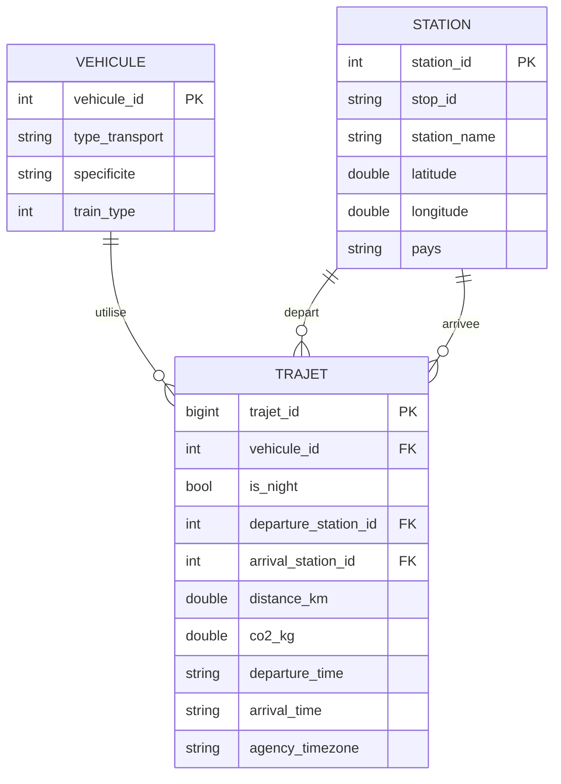

# MCD / MPD - ObRail Europe

## MCD (conceptuel)

## MPD (physique)
Voir `data/scripts/mart/schema_transport.sql`.

### Resume
- `vehicule` : dimension des types de transport.
- `station` : dimension des gares/aeroports.
- `trajet` : faits des trajets (distance, CO2, liens aux dimensions).

## Justifications MCD
- 3 entites principales suffisent pour couvrir le besoin: `station`, `vehicule`, `trajet`.
- Le besoin met l accent sur l analyse de trajets (distance, CO2, jour/nuit). Le fait `trajet` est donc central.
- `station` isole les informations geographiques et pays pour eviter la duplication et faciliter les aggregations par pays.
- `vehicule` isole le type de transport et la specificite (TGV/RER/Intercite/Avion) pour les comparatifs et filtres.
- Deux relations `trajet` -> `station` (depart/arrivee) permettent de mesurer les flux, le cross-border et les distances.
- Le MCD reste volontairement compact pour garantir des chargements rapides et un usage simple par des analystes.

## Justifications MPD
- Identifiants techniques (surrogate keys) pour `station_id` et `vehicule_id` afin d eviter les collisions entre sources heterogenes.
- `trajet_id` en `bigint` pour supporter un grand volume de trajets et des futures itérations.
- Types `double` pour `latitude`, `longitude`, `distance_km`, `co2_kg` afin de conserver la precision numerique.
- Contrainte FK sur `trajet.vehicule_id`, `trajet.departure_station_id`, `trajet.arrival_station_id` pour garantir l integrite.
- `stop_id` est conserve dans `station` car il est disponible dans GTFS, mais reste nullable pour d autres sources.
- `pays` est stocke dans `station` pour faciliter les aggregations et la couverture par pays sans jointures complexes.
- `is_night` est stocke dans `trajet` pour eviter des recalculs couteux lors des requetes.
- `departure_time` et `arrival_time` sont optionnels (NULL si stop_times desactive).
- `agency_timezone` conserve le fuseau horaire d origine (utile pour conversions vers CET).

## Considerations de qualite et exploitabilite
- Schema en etoile simple pour faciliter les analyses (stats, tableaux de bord, API).
- Separation des dimensions pour limiter la duplication et simplifier le nettoyage.
- Champs critiques (pays, coords, distance, CO2) sont accessibles directement pour les controles qualite.
